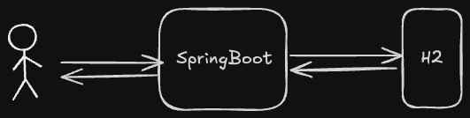

# Framework-Agnostic Java Development Demo

## Overview
This repository showcases **framework-agnostic development in Java**. The different branches explore various ways to refactor the original implementation, ensuring loose coupling and maintainability while demonstrating integration with frameworks like Spring or alternatives

This branch contains the base application for the talk **"Java Beyond Frameworks: Avoiding Lock-In with Agnostic Design"**

## App Preview

